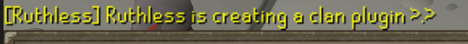
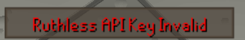
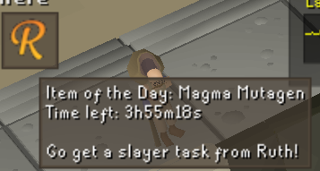

# Ruthless

Plugin for helping with clan related features within Ruthless.

## Features

### Broadcasts

Gets broadcasts from Clan Staff once per session to display

### API Key validation

Generate your API key within Discord first, put it in the configuration of the plugin. If you do not set the API key or it is invalid, it will display an infobox letting you know

### Ruthless Infobox

Gets the current Item of the Day information and your Ruthless Slayer task information to display within an infobox

you can hide item of the day or slayer task info from the infobox if you desire.

### New Slayertask notification

When a new slayer task is detected, allows a message to show up in the chatbox

### Autosubmission

Autosubmits your times and pbs when killing bosses to the ruthless API.