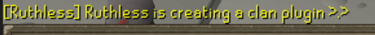
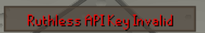

# Ruthless

Plugin for helping with clan related features within Ruthless.

## Features

### Broadcasts

Gets broadcasts from Clan Staff once per session to display

### API Key validation

Generate your API key within Discord first, put it in the configuration of the plugin. If you do not set the API key or it is invalid, it will display an infobox letting you know

### Autosubmission

Autosubmits your times and pbs when killing bosses to the ruthless API. Also if your dropped item matches a whitelist, it will auto submit to ruthless API.